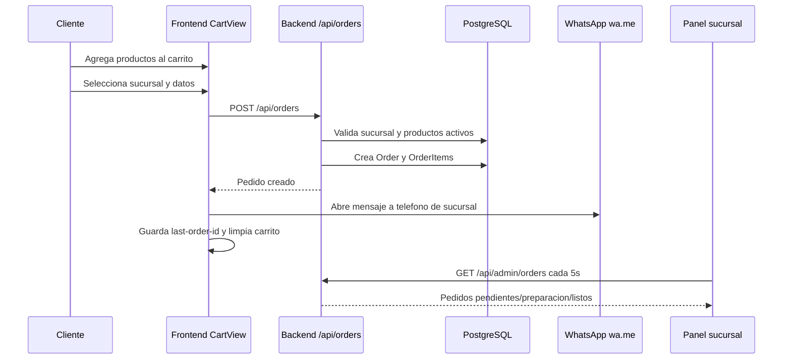
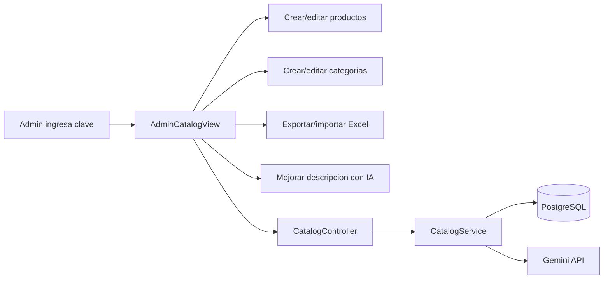
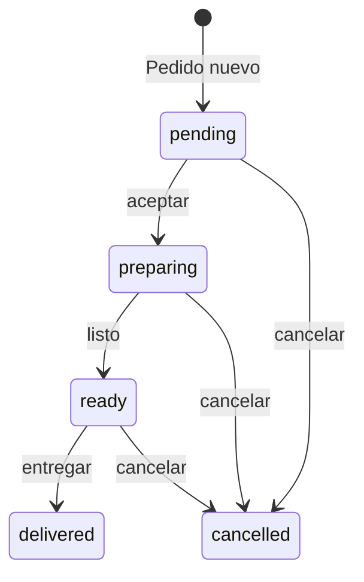
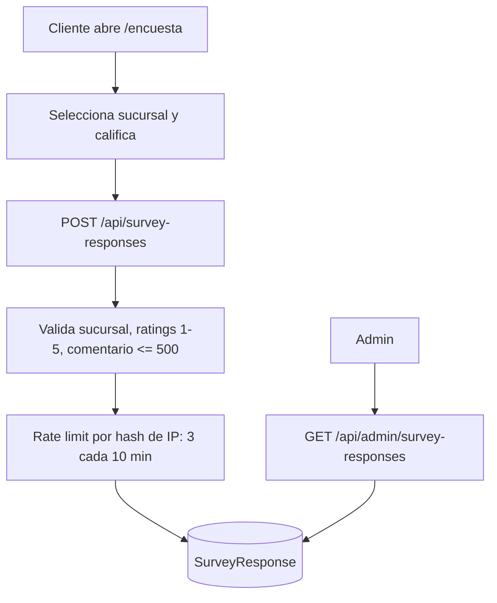

# Reporte completo del sistema Fatboy Menu Web

Fecha: 2026-07-09  
Proyecto revisado: `C:\app\menufatboy2026`  
Alcance: revision estatica del codigo, configuracion Docker, esquema Prisma, frontend, backend y verificaciones locales.

## 1. Resumen ejecutivo

El sistema es una aplicacion web/PWA para el menu de Fatboy con dos superficies principales:

- Cliente: menu, promociones, carrito, pedidos por sucursal, perfil, puntos, canjes, reseñas de Google y encuesta.
- Operacion/admin: catalogo, productos, categorias, pedidos, clientes, recompensas, banners, promociones, visitas, feedback y encuestas.

La arquitectura actual compila correctamente. `npm run lint` paso en frontend y backend. `npm run build` tambien paso. El build aviso que el bundle principal de frontend es grande: `627.27 kB` minificado.

La falla tecnica mas importante no es de compilacion; es de controles operativos y seguridad:

- La administracion se protege con una sola clave compartida (`x-admin-key`).
- Los roles de sucursal existen en la interfaz, pero no se validan en el backend.
- El pedido valida producto y precio base desde la base de datos, pero no valida bien cantidad, extras, tipo de entrega, metodo de pago ni puntos a redimir.
- El carrito vive solo en memoria; una recarga o actualizacion PWA puede borrar un pedido armado.
- Hay vulnerabilidades reportadas por `npm audit --omit=dev` en dependencias transitivas.

## 2. Mapa general del sistema

```mermaid
flowchart TD
  Cliente[Cliente móvil / navegador / PWA]
  Staff[Personal de sucursal]
  Admin[Administrador]

  Cliente --> Frontend[Frontend React + Vite]
  Staff --> BranchOrders[/branch-orders]
  Admin --> AdminCatalog[/admin-catalog]

  Frontend --> ApiClient[src/lib/api.ts]
  BranchOrders --> ApiClient
  AdminCatalog --> ApiClient

  ApiClient --> Nginx[Nginx frontend / proxy o API pública]
  Nginx --> Backend[NestJS API /api]

  Backend --> Catalog[CatalogModule]
  Backend --> Auth[AuthModule]
  Backend --> Orders[OrderModule]
  Backend --> Survey[SurveyModule]
  Backend --> Prisma[PrismaService]
  Prisma --> Postgres[(PostgreSQL)]

  Catalog --> Excel[Export/import Excel]
  Catalog --> Uploads[uploads/promotions]
  Catalog --> Gemini[Google Gemini API]

  Frontend --> WhatsApp[wa.me por sucursal]
  Frontend --> GoogleMaps[Google Maps / Review URLs]
  Frontend --> ServiceWorker[Service Worker / cache PWA]
```

## 3. Componentes principales

### Frontend

Tecnologia: React 19, Vite, TypeScript, Tailwind, Motion, lucide-react.

Rutas/pantallas reales:

- `/`: aplicacion cliente con navegacion interna.
- `/admin-catalog`: panel administrativo completo.
- `/branch-orders`: panel operativo para sucursales.
- `/encuesta`: encuesta anonima.
- Ruta de reseñas Google manejada desde `App.tsx` y `lib/googleReviews.ts`.

Pantallas principales:

- `HomeView`: inicio, banners, accesos a menu, sucursales y WhatsApp.
- `MenuView`: categorias y productos activos.
- `ProductDetailView`: personalizacion y cantidad.
- `CartView`: genera pedido, abre WhatsApp y guarda ultimo pedido en `sessionStorage`.
- `OrderTrackingView`: consulta ultimo pedido.
- `ProfileView`: perfil, puntos, sucursal favorita, reseñas.
- `RewardsView`: canje de productos por puntos.
- `BranchesView`: mapa visual y datos de sucursales.
- `AdminCatalogView`: administracion de catalogo, clientes, pedidos, promociones, encuestas, etc.
- `BranchOrdersView`: operacion diaria por sucursal con polling cada 5 segundos.

### Backend

Tecnologia: NestJS 11, Prisma 6, PostgreSQL, ExcelJS, Google GenAI.

Modulos:

- `CatalogModule`: sucursales, categorias, productos, recompensas, clientes, banners, promociones, settings, feedback y visitas.
- `AuthModule`: registro, login, sesiones, perfil y cambio de contraseña.
- `OrderModule`: creacion, consulta y estado de pedidos.
- `SurveyModule`: encuesta publica y reporte admin.
- `PrismaModule`: acceso a PostgreSQL.

### Base de datos

Modelos principales:

- `Branch`
- `Category`
- `Product`
- `Customer`
- `Session`
- `Order`
- `OrderItem`
- `RedeemableProduct`
- `RewardRedemption`
- `HomeBanner`
- `Promotion`
- `SystemSetting`
- `Feedback`
- `SurveyResponse`
- `VisitCounter`

Hay 15 migraciones en `backend/prisma/migrations`.

## 4. Procesos actuales

### 4.1 Proceso de pedido de cliente



Riesgo del proceso: si WhatsApp no abre o el personal no tiene abierto `/branch-orders`, el pedido queda en base pero puede no ser visto a tiempo.

### 4.2 Proceso de catalogo



El backend valida precios, estatus, categorias existentes y formato Excel. La importacion Excel solo actualiza productos existentes; no crea ni elimina.

### 4.3 Proceso de administracion de pedidos



Actualmente el backend solo valida que el estado sea uno de los permitidos. No valida transiciones, rol, sucursal asignada ni permisos por usuario.

### 4.4 Proceso de encuesta



## 5. Fallas y riesgos encontrados

### Critico / Alto

1. Admin con clave compartida y sin usuarios reales

Ubicacion: `backend/src/modules/catalog/catalog.controller.ts`, `backend/src/modules/order/order.controller.ts`, `frontend/src/views/AdminCatalogView.tsx`, `frontend/src/views/BranchOrdersView.tsx`.

Impacto:

- Cualquier persona con la clave puede operar todo.
- No hay auditoria por usuario.
- La clave se guarda en `sessionStorage` como `fatboy-admin-key`.
- No hay expiracion, rotacion controlada, bloqueo por intentos ni permisos por modulo.

Proceso recomendado:

1. Crear modelo `AdminUser` o `StaffUser` con `role`, `branchId`, `passwordHash`, `active`.
2. Reemplazar `x-admin-key` por sesion/token de admin.
3. Agregar guard backend para cada endpoint administrativo.
4. Registrar auditoria minima: usuario, accion, entidad, fecha, IP.
5. Mantener `ADMIN_CATALOG_KEY` solo como llave temporal de emergencia durante migracion.

2. Roles de sucursal solo existen en frontend

Ubicacion: `frontend/src/views/BranchOrdersView.tsx`.

Impacto:

- `manager`, `cashier` y `admin` cambian botones y textos, pero el backend no sabe el rol.
- `canFinalize = role !== 'cashier' || true` siempre da `true`.
- El endpoint `PATCH /api/admin/orders/:id/status` permite cambiar cualquier pedido si se tiene la clave admin.

Proceso recomendado:

1. Agregar usuarios de sucursal con `branchId` y rol real.
2. Validar en backend que el usuario solo vea/cambie pedidos de su sucursal.
3. Validar acciones por rol: cancelar, finalizar, imprimir, ver canjes.
4. Quitar permisos simulados del frontend o dejarlos solo como UI secundaria.

3. Validacion incompleta de pedidos

Ubicacion: `backend/src/modules/order/order.service.ts`.

Impacto:

- `qty` viene del cliente y no se valida como entero positivo.
- `extras.price` viene del cliente y puede alterar el total.
- `pointsToRedeem` no se normaliza como entero positivo antes de usarse.
- `deliveryType` y `paymentMethod` aceptan defaults, pero no se rechazan valores invalidos.
- Un payload malicioso podria generar totales incorrectos, descuentos indebidos o datos operativos sucios.

Proceso recomendado:

1. En `createOrder`, validar `deliveryType in ['pickup','delivery']` y `paymentMethod in ['cash','card']`.
2. Validar cada item: producto existente, cantidad entera entre 1 y un limite razonable.
3. No confiar en precios de extras del cliente; usar catalogo backend de extras o permitir extras con precio `0` hasta modelarlos.
4. Validar `pointsToRedeem` como entero positivo y caparlo al subtotal.
5. Agregar un test chico de `OrderService` para cantidad negativa, extra negativo y puntos invalidos.

4. XSS posible en impresion de tickets

Ubicacion: `frontend/src/views/BranchOrdersView.tsx`, funcion `handlePrint`.

Impacto:

- Se usa `document.write` con datos de cliente, notas y productos.
- Si un campo contiene HTML/script, puede inyectarse en la ventana de impresion.

Proceso recomendado:

1. Crear helper minimo `escapeHtml(value)`.
2. Aplicarlo a cliente, telefono, notas, producto, extras y removals antes de escribir HTML.
3. Mantener estilos de ticket igual.
4. Probar con un pedido que contenga `<script>alert(1)</script>` como nota; debe imprimirse como texto.

5. Vulnerabilidades de dependencias

Verificacion ejecutada: `npm audit --omit=dev`.

Resultado:

- `multer`: severidad alta, via `@nestjs/platform-express`.
- `uuid`: severidad moderada, via `exceljs`.
- `esbuild`: reporte asociado al servidor de desarrollo en Windows, via `tsx`.
- Total: 5 vulnerabilidades: 1 baja, 2 moderadas, 2 altas.

Proceso recomendado:

1. Ejecutar primero `npm audit fix`.
2. Revisar cambios en `package-lock.json`.
3. Correr `npm run lint` y `npm run build`.
4. Probar import/export Excel y subida de imagen de promocion.
5. Evitar `npm audit fix --force` sin prueba, porque propone cambio mayor en `exceljs`.

### Medio

6. Detalles de sucursal duplicados entre base y codigo

Ubicacion: `CatalogService.fixedBranchDetails`.

Impacto:

- La tabla `branches` existe, pero telefono, direccion, horario y maps se sobreescriben por nombre desde codigo.
- Agregar o cambiar sucursal requiere migracion/datos y cambio de backend.
- Un cambio de nombre puede romper el match por texto.

Proceso recomendado:

1. Mover telefono, direccion, horario y mapsUrl a la tabla `branches` como fuente unica.
2. Crear migracion para completar datos faltantes.
3. Eliminar `FIXED_BRANCH_DETAILS` cuando la base tenga todos los datos.
4. Mantener una prueba manual: `/api/branches` debe alimentar Home, Profile, Cart y BranchesView.

7. Integridad referencial parcial

Ubicacion: `backend/prisma/schema.prisma`.

Impacto:

- `Order.branchId` no tiene relacion Prisma con `Branch`.
- `Customer.favoriteBranchId` tampoco tiene relacion con `Branch`.
- Se permite conservar `branchName` como snapshot historico, lo cual esta bien, pero falta constraint para IDs vivos.

Proceso recomendado:

1. Agregar relaciones opcionales a `Branch` para favoritos y pedidos si el historial lo permite.
2. Si no conviene por historial, validar branchId en backend en cada escritura y agregar indices.
3. Documentar que `branchName` es snapshot historico y `branchId` es referencia operativa.

8. Carrito solo en memoria

Ubicacion: `frontend/src/context/CartContext.tsx`.

Impacto:

- Si el usuario recarga, cierra pestana o la PWA actualiza, pierde el carrito.
- El service worker puede recargar cuando detecta version nueva.

Proceso recomendado:

1. Persistir carrito en `localStorage` con version de esquema simple.
2. Limpiar carrito solo al crear pedido exitoso.
3. Al cambiar producto/precio, recalcular siempre en backend como ya se hace.
4. Agregar confirmacion visual si hay actualizacion PWA mientras el carrito tiene productos.

9. Actualizacion PWA recarga sin pedir confirmacion

Ubicacion: `frontend/src/main.tsx`.

Impacto:

- Puede refrescar la app mientras el cliente esta en carrito o registro.
- Afecta mas porque el carrito no esta persistido.

Proceso recomendado:

1. Detectar version nueva y mostrar banner "Nueva version disponible".
2. Solo recargar cuando el usuario acepte o cuando no haya carrito/formulario activo.
3. Excluir admin y branch-orders se mantiene correcto.

10. Bundle frontend grande

Verificacion: `npm run build`.

Resultado:

- `dist/assets/index-3pEqf4AJ.js`: `627.27 kB` minificado.

Proceso recomendado:

1. Cargar con `React.lazy` pantallas pesadas: `AdminCatalogView`, `BranchOrdersView`, `SurveyView`, `GoogleReviewView`.
2. Separar librerias grandes en chunks: motion, Google Maps, admin.
3. Volver a correr `npm run build` y comparar tamanos.
4. No agregar dependencias nuevas para esto.

11. Imagenes de promociones en filesystem local del contenedor

Ubicacion: `CatalogService.savePromotionImage`, `uploads/promotions`.

Impacto:

- Si el contenedor se recrea sin volumen persistente, las imagenes subidas desde admin pueden perderse.

Proceso recomendado:

1. Montar volumen persistente para `uploads/promotions`.
2. O mover imagenes a storage externo.
3. Documentar backup/restauracion de esa carpeta.

12. Host de API hardcodeado en frontend y nginx

Ubicacion: `frontend/src/lib/api.ts`, `frontend/nginx.conf`, `frontend/.env.example`.

Impacto:

- Produccion cae por defecto a `https://bakendmenu.fatboymexicali.com/api`.
- El CSP tambien conoce ese host.
- Cambiar dominio requiere revisar varios archivos/configs.

Proceso recomendado:

1. Usar `VITE_API_BASE_URL` en build de produccion.
2. Mantener fallback solo para desarrollo local.
3. Si el frontend y backend conviven tras el mismo dominio, preferir `/api`.
4. Revisar si `bakendmenu` esta escrito asi intencionalmente.

### Bajo / Mejora operativa

13. Login de clientes sin rate limit

Impacto: permite intentos repetidos sobre telefono/contrasena.

Proceso recomendado:

1. Agregar rate limit por IP y telefono.
2. Registrar intentos fallidos.
3. Responder con mensaje generico.

14. Hash de contrasena debil para estandar actual

Ubicacion: `AuthService.hashPassword`, PBKDF2 con 1000 iteraciones.

Proceso recomendado:

1. Subir iteraciones PBKDF2 a un valor moderno o migrar a Argon2/bcrypt.
2. Implementar migracion gradual: al login correcto, rehash si el hash viejo usa pocas iteraciones.
3. No invalidar todas las cuentas de golpe.

15. Sin pruebas automatizadas de reglas criticas

Impacto: lint/build pasan, pero no cubren reglas de dinero, puntos, pedidos ni permisos.

Proceso recomendado:

1. Agregar pruebas pequenas para `OrderService`.
2. Agregar pruebas para canje de puntos.
3. Agregar prueba de encuesta rate limit.
4. Mantenerlas chicas y enfocadas; no hace falta una suite enorme para empezar.

## 6. Mejoras recomendadas por prioridad

### Prioridad 1: cerrar riesgos de dinero, permisos y XSS

Objetivo: evitar pedidos manipulados, operaciones no autorizadas e inyeccion en ticket.

Proceso:

1. Validar payload de pedidos en backend.
2. Escapar HTML en impresion.
3. Quitar `canFinalize = role !== 'cashier' || true`.
4. Agregar validacion backend de rol/sucursal antes de cambiar estados.
5. Correr `npm run lint`, `npm run build` y pruebas manuales de pedido.

### Prioridad 2: mejorar seguridad admin

Objetivo: reemplazar clave unica por usuarios reales.

Proceso:

1. Crear modelos de usuario staff/admin.
2. Crear login admin separado.
3. Reemplazar `x-admin-key` por token de sesion.
4. Agregar auditoria basica.
5. Mantener ruta de emergencia temporal con `ADMIN_CATALOG_KEY`.

### Prioridad 3: estabilizar sucursales como dato

Objetivo: que `/api/branches` sea la unica verdad.

Proceso:

1. Migrar telefono, direccion, horario y mapsUrl a datos reales en DB.
2. Eliminar detalles fijos por nombre.
3. Probar Home, Profile, Cart y BranchesView.
4. Documentar proceso para activar nueva sucursal.

### Prioridad 4: proteger experiencia PWA/carrito

Objetivo: no perder pedidos armados.

Proceso:

1. Persistir carrito.
2. Mostrar aviso de actualizacion antes de recargar.
3. Probar en mobile y desktop con carrito lleno.

### Prioridad 5: dependencias y rendimiento

Objetivo: reducir deuda tecnica sin rediseñar.

Proceso:

1. `npm audit fix`.
2. `npm run lint`.
3. `npm run build`.
4. Code-splitting de rutas pesadas.
5. Comparar bundle antes/despues.

## 7. Checklist de validacion sugerido

### Cliente

- Abrir home y verificar banners.
- Abrir menu y filtrar categorias.
- Agregar producto normal y promocion al carrito.
- Crear pedido invitado.
- Crear pedido con cliente logueado.
- Redimir puntos.
- Confirmar que WhatsApp abre al telefono correcto de sucursal.
- Revisar ultimo pedido.
- Instalar PWA y navegar offline a la shell.

### Operacion

- Entrar a `/branch-orders`.
- Seleccionar sucursal.
- Ver pedido nuevo.
- Pasar de nuevo a preparacion, listo, entregado.
- Cancelar pedido con rol permitido.
- Imprimir ticket con notas y extras.
- Confirmar que ventas del dia solo suman entregados.

### Admin

- Entrar a `/admin-catalog`.
- Crear/editar/desactivar producto.
- Exportar Excel.
- Importar Excel modificado.
- Crear banner.
- Crear promocion con imagen.
- Revisar clientes y puntos.
- Revisar encuestas con filtros.
- Revisar feedback y visitas.

### Backend/despliegue

- `GET /api/health`.
- `GET /api/branches`.
- `GET /api/categories?status=active`.
- `GET /api/products?status=active`.
- `POST /api/orders` con payload valido.
- `POST /api/orders` con cantidad negativa debe fallar despues de corregir.
- Reiniciar backend tras migraciones y validar `/api/branches`.

## 8. Evidencia de verificaciones

Comandos ejecutados:

```bash
npm run lint
npm run build
npm audit --omit=dev
```

Resultados:

- `npm run lint`: correcto.
- `npm run build`: correcto.
- Advertencia de build: chunk principal frontend mayor a 500 kB.
- `npm audit --omit=dev`: 5 vulnerabilidades reportadas.

## 9. Conclusion

El sistema esta funcional y construye correctamente. La base ya tiene una separacion razonable entre frontend, API y PostgreSQL. El siguiente avance no deberia ser agregar mas modulos; deberia ser endurecer lo que ya existe: validacion de pedidos, permisos reales, seguridad admin, persistencia del carrito y limpieza de dependencias.

La ruta mas corta y de mayor impacto es:

1. Validar pedidos en backend.
2. Escapar ticket de impresion.
3. Reemplazar permisos simulados por permisos backend.
4. Persistir carrito.
5. Aplicar `npm audit fix` y verificar.
